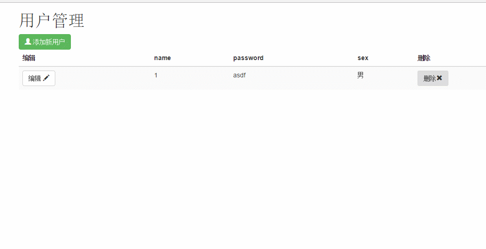

## React+Redux+React-router简单Demo

安装依赖：

    npm install
运行：

    npm start

###所参考文档：
[React中文文档](http://reactjs.cn/react/docs/getting-started-zh-CN.html)
[Redux中文文档](http://cn.redux.js.org/index.html)
[React-router中文文档](http://react-guide.github.io/react-router-cn/)
[ES6入门教程](http://es6.ruanyifeng.com/)

***

###知识点总结：
####redux
* render里面state不可直接修改，可以使用Object.assgin创建副本或者使用[...state]!
*  render拆分管理不同state (combineReducers)

####react+react-router
*  把store绑定到路由上
*  通过connect的mapStateToProps参数把redux的state绑定到props，然后在页面通过props得到数据
*  通过connect的mapDispatchToProps参数把action绑定到props，state改变时渲染页面