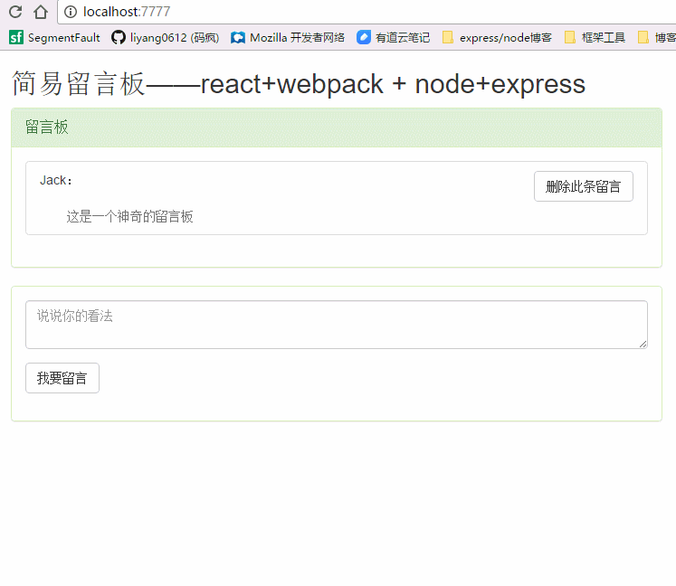

##react留言板（未完待续...）
###react+redux 和 express+mongodb
[React中文文档](http://reactjs.cn/react/docs/getting-started-zh-CN.html)

[Redux中文文档](http://cn.redux.js.org/index.html)

[mongodb快速安装启动](http://www.runoob.com/mongodb/mongodb-window-install.html)

###注意事项
- 此脚手架不支持webpack2.0；与babel编译时报错
- 先安装启动mongodb,然后在npm start

###知识点总结
####数据库连接

    var db = mongoose.connect('mongodb://127.0.0.1:27017/message');
    //建立骨架模型
    var Schema = mongoose.Schema;
    var userText = new Schema({
        text: String,
        key: String
    })
    //留言数据模型entity
    var text = mongoose.model('text', userText);

#####连接数据库和集合的时候如果，当前地址没有此数据库和集合，它会自动创建

      var db = mongoose.connect('mongodb://127.0.0.1:27017/message');
      ....
      var text = mongoose.model('text', userText);

####增删查
#####增加数据
方法1：通过model添加（model——上述的text）

    text.create({},callback)
方法2：通过entity添加

    var entity = new text({demo: "文档数据"})
    entity.save(function(error,doc) {

    });
#####删除数据
    text.remove(req.body, function (err) {

      })

#####
    text.find(function (err, doc) {

                  })